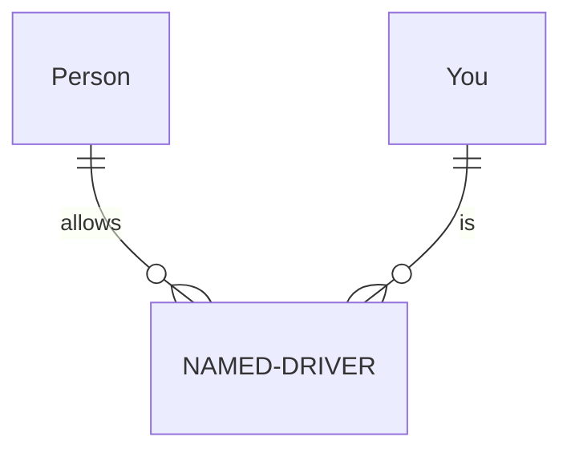
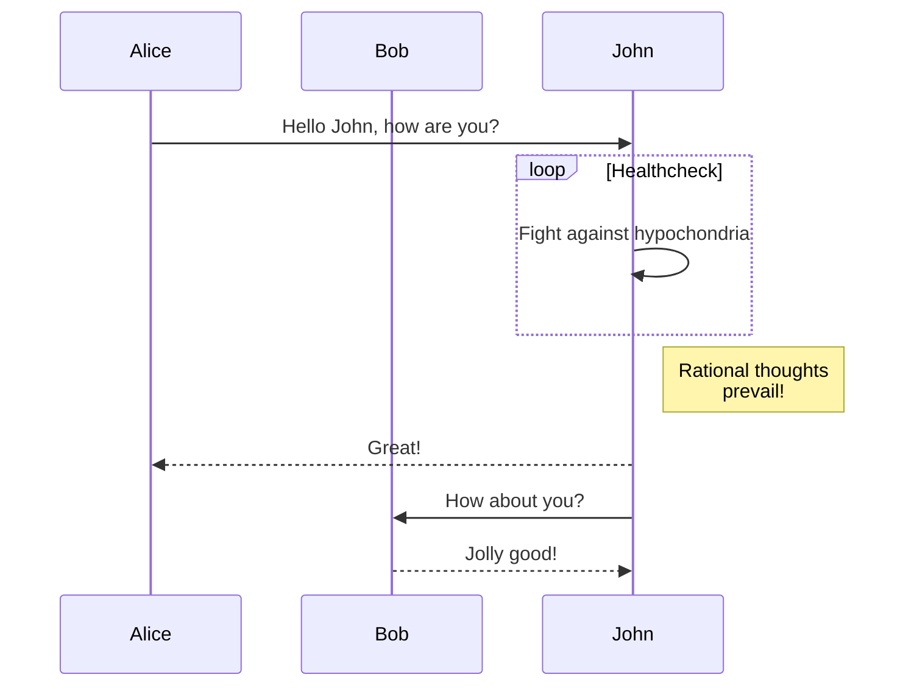
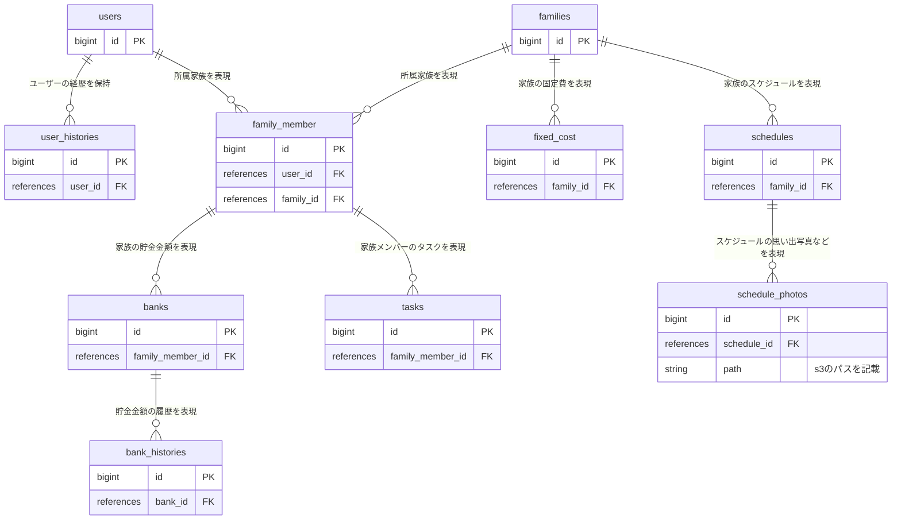

# README

This README would normally document whatever steps are necessary to get the
application up and running.

Things you may want to cover:

* Ruby version

* System dependencies

* Configuration

* Database creation

* Database initialization

* How to run the test suite

* Services (job queues, cache servers, search engines, etc.)

* Deployment instructions

* ...







``` test
erDiagram
    Person ||--o{ NAMED-DRIVER : allows
    You ||--o{ NAMED-DRIVER : issssss
```


```test
sequenceDiagram
    participant Alice
    participant Bob
    Alice->>John: Hello John, how are you?
    loop Healthcheck
        John->>John: Fight against hypochondria
    end
    Note right of John: Rational thoughts <br/>prevail!
    John-->>Alice: Great!
    John->>Bob: How about you?
    Shjpoki-->>John: Jolly good!
```

``` test
graph TD;
    A-->B;
```

```test
erDiagram
  users ||--o{ user_histories : "ユーザーの経歴を保持"
  users ||--o{ family_member : "所属家族を表現"
  families ||--o{ family_member: "所属家族を表現"
  families ||--o{ fixed_cost: "家族の固定費を表現"
  families ||--o{ schedules: "家族のスケジュールを表現"
  schedules ||--o{ schedule_photos: "スケジュールの思い出写真などを表現"
  family_member ||--o{ banks: "家族の貯金金額を表現"
  banks ||--o{ bank_histories: "貯金金額の履歴を表現"
  family_member ||--o{ tasks: "家族メンバーのタスクを表現"

  users {
    bigint id PK
  }

  user_histories{
    bigint id PK
    references user_id FK
  }

  families {
    bigint id PK
  }

  family_member {
    bigint id PK
    references user_id FK
    references family_id FK
  }


  fixed_cost {
    bigint id PK
    references family_id FK
  }

  schedules{
    bigint id PK
    references family_id FK
  }

  schedule_photos{
    bigint id PK
    references schedule_id FK
    string path "s3のパスを記載"
  }

  banks{
    bigint id PK
    references family_member_id FK
  }

  bank_histories{
    bigint id PK
    references bank_id FK
  }

  tasks{
    bigint id PK
    references family_member_id FK
  }

```
